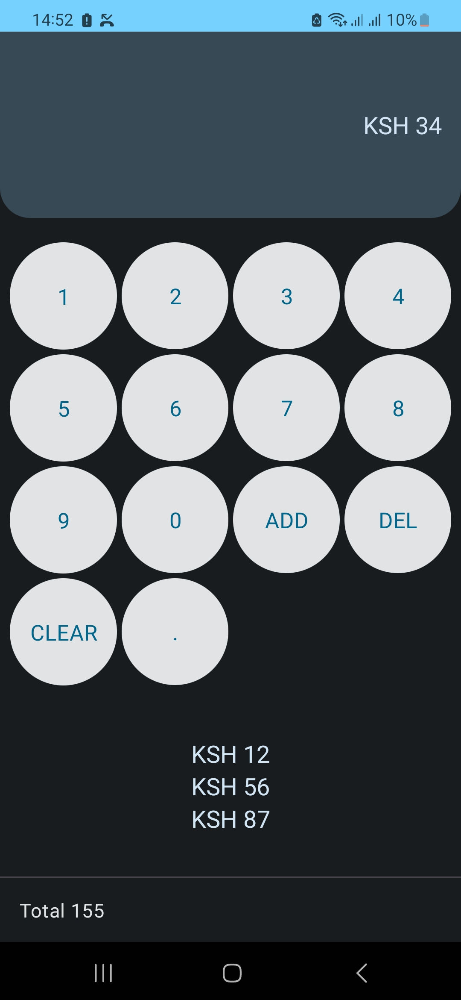
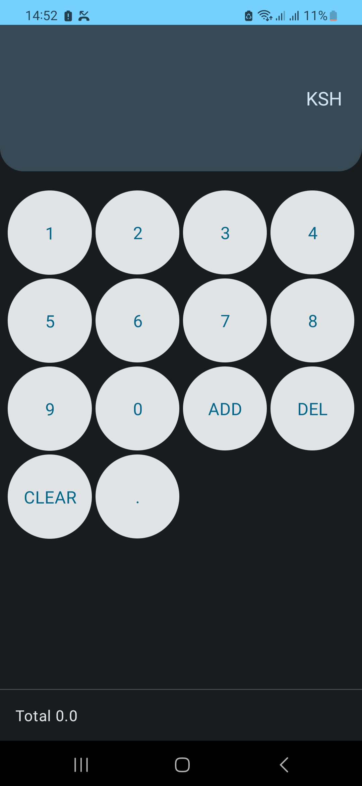

## CashRegister

*Summary*
- This is a Native Android app, that a user can add values to a register. The values added are cached to the db and displayed
- The User can also choose to delete a value before adding to the register
- The User can also choose to clear all data from the list
- When the values are added, a total summation of the values is also shown on the screen

The final app looks like this:👀

 

*Screens*
- **Main Screen**:
    - Since this is a small app, everything happens on the main screeen
    - A user can enter values from the cash register and add the values
    - The List of values added are then updated on the screen and cached to the database
    - A user can also clear the list and it will delete all values from the list
    - A user while manipulating the cash register, the user can choose to delete a value before adding to the list, by clicking delete

*Environment*
- Built on A.S Giraffe(Patch 3)
- JDK 17

# Design/Architectural decisions 📐

The project makes use of common android patterns in modern android codebases.

**Project Structure**

The folders are split into 4 boundaries:
- **Data**:
  Contains the implementation from the domain layer interface

- **Domain**:

  Contains the data models/interfaces that would be implemented on the data layer

- **DI**:

  This acts as the glue between the data ,domain and presentation.The presentation relies on the domain models and interfaces which are implemented in data.

- **Presentation**:

  Contains the UI layer of the app, the screen components and viewmodels. Framework specific dependencies are best suited for this layer.

- **DesignSystem**:

  In this layer, its made up of composable widgets and the application theme including(themes, Colors) that are reused when making up the composable screens


**Testing**

Unit tests are done on three sections. First the database is tested to confirm everything is working well with 
the database since its our source of truth. The second test is done on the repository to confirm the data is being received correctly
and lastly the viewModel is tested to confirm that the UI state is being correctly mapped to the database.

## Tech-stack

* Tech-stack
    * [Kotlin](https://kotlinlang.org/) - a cross-platform, statically typed, general-purpose programming language with type inference.
    * [Coroutines](https://kotlinlang.org/docs/reference/coroutines-overview.html) - perform background operations.
    * [Flow](https://kotlinlang.org/docs/reference/coroutines/flow.html) - handle the stream of data asynchronously that executes sequentially.
    * [Jetpack](https://developer.android.com/jetpack)
        * [Flows](https://developer.android.com/kotlin/flow) - is an observable data holder.
        * [ViewModel](https://developer.android.com/topic/libraries/architecture/viewmodel) - store and manage UI-related data in a lifecycle conscious way.
    * [Timber](https://github.com/JakeWharton/timber) - a highly extensible android logger.
    * [Hilt](https://developer.android.com/training/dependency-injection/hilt-android)

* Architecture
    * MVVM - Model View ViewModel
* Tests
    * [Unit Tests](https://en.wikipedia.org/wiki/Unit_testing) ([JUnit](https://junit.org/junit4/)) - a simple framework to write repeatable tests.
    * [MockK](https://github.com/mockk) - mocking library for Kotlin
    * [Turbine](https://github.com/cashapp/turbine) - A small testing library for kotlinx.coroutines Flow

* Gradle
    * [Gradle Kotlin DSL](https://docs.gradle.org/current/userguide/kotlin_dsl.html) - Alternative syntax from the traditional Groovy
    * Plugins
        * [Ktlint](https://github.com/JLLeitschuh/ktlint-gradle) - creates convenient tasks in your Gradle project that run ktlint checks or do code auto format.
        * [Detekt](https://github.com/detekt/detekt) - a static code analysis tool for the Kotlin programming language.
        * [Spotless](https://github.com/diffplug/spotless) - Adds Licence header.
* CI/CD
    * Github Actions
    * [Fastlane](https://fastlane.tools)

# LICENSE

```
   Copyright 2023 Caleb langat

   Licensed under the Apache License, Version 2.0 (the "License");
   you may not use this file except in compliance with the License.
   You may obtain a copy of the License at

       http://www.apache.org/licenses/LICENSE-2.0

   Unless required by applicable law or agreed to in writing, software
   distributed under the License is distributed on an "AS IS" BASIS,
   WITHOUT WARRANTIES OR CONDITIONS OF ANY KIND, either express or implied.
   See the License for the specific language governing permissions and
   limitations under the License.
   
```